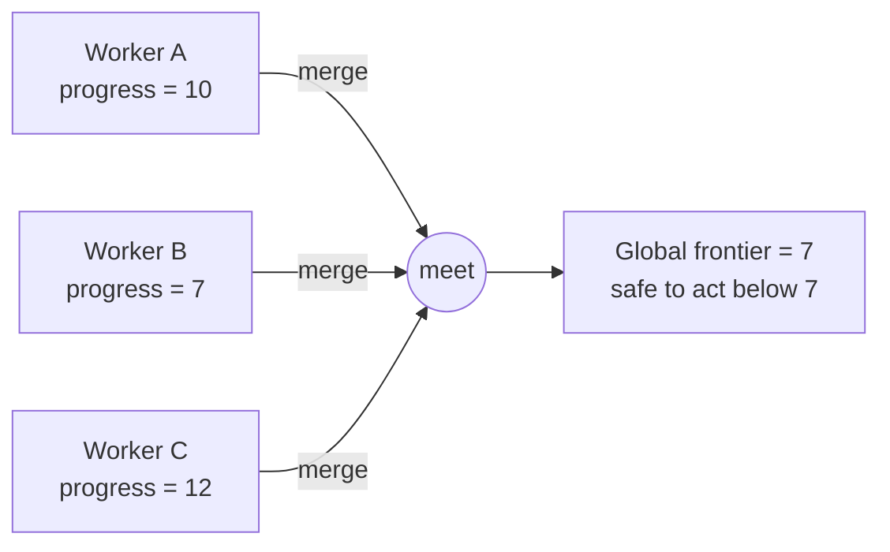

# antichain

**Track progress across a distributed system — without a central coordinator.**

[](https://github.com/trickle-labs/antichain/actions/workflows/ci.yml)
[](https://crates.io/crates/antichain)
[](https://docs.rs/antichain)

```toml
[dependencies]
antichain = "0.3.1"
```

---

## The 30-second version

Many workers are chewing through a stream of work. Every so often, *something* needs to
know: **"Is it safe to act now? Has everyone gotten far enough?"**

The textbook answer is to put a coordinator in the middle: every worker reports its progress,
the coordinator computes a single global number, and broadcasts "you may proceed." That works
— but the coordinator is now a bottleneck and a single point of failure.

`antichain` lets workers answer that question **by merging their progress directly**, in any
order, over any network, with no coordinator at all:

```rust
use antichain::Frontier;

// Two workers report how far they've gotten, independently.
let worker_a = Frontier::from_elem(10u64);
let worker_b = Frontier::from_elem(7u64);

// The safe global progress is the *meet* — the most conservative bound.
let global = worker_a.meet(&worker_b);
assert_eq!(global, Frontier::from_elem(7u64));

// It doesn't matter who merges with whom, or in what order — same answer every time.
assert_eq!(worker_a.meet(&worker_b), worker_b.meet(&worker_a));
```

That `meet` operation is the heart of the crate. It is **commutative, associative, and
idempotent**, which is exactly what lets you delete the coordinator.

---

## The problem, in plain terms

Picture a fleet of workers reading from a partitioned log, or a set of replicas tailing a
write-ahead log, or a cluster of stream operators advancing event-time. Each one is making
progress at its own pace. Downstream, some consumer wants to take an action that is only safe
once *everyone* has passed a certain point — closing a time window, garbage-collecting old
state, emitting a final aggregate, acknowledging an offset back to the source. The consumer
needs a single trustworthy number: **the watermark below which all work is provably complete.**

The instinct is to elect a coordinator. Every worker phones home with its current position,
the coordinator takes the minimum, and hands back the global watermark. It is simple to reason
about and it is exactly the design that keeps teams awake at 3 a.m. The coordinator is a
bottleneck that every worker must reach, a single process whose failure stalls the whole
pipeline, and a piece of shared mutable state that needs leader election, leases, and failover
the moment you care about availability. You have turned a progress-tracking question into a
distributed-consensus problem.

`antichain` removes the coordinator entirely. Instead of every worker reporting *up* to a
central authority, workers exchange their progress *sideways* — peer to peer, in whatever
pattern your network already supports — and merge what they receive with a single algebraic
operation. There is no leader to elect, no lease to renew, no single process whose death stops
the world. Each node can compute the global answer locally, and every node that has seen the
same information will compute the *identical* answer.

---

## Why that works

The whole trick rests on `meet` being a *lattice* operation with three properties. They sound
abstract, but each one directly licenses a concrete freedom you need in a real distributed
system:

| Property | Meaning | Why you care |
|----------|---------|--------------|
| **Commutative** | `meet(a, b) == meet(b, a)` | Workers can merge in any pairing — A-then-B or B-then-A is the same. |
| **Associative** | `meet(a, meet(b, c)) == meet(meet(a, b), c)` | Grouping doesn't matter — batch updates or fold them one at a time. |
| **Idempotent** | `meet(a, a) == a` | Duplicate and re-delivered messages are harmless. |

Put together, these three laws guarantee that nodes can gossip progress over a hostile network
— messages delayed, reordered, duplicated, or dropped and retried — and **still converge to
the identical, correct answer**, with no lock, no pause, and no leader. Commutativity and
associativity mean the *order* of delivery is irrelevant; idempotence means *redelivery* is
irrelevant. A network that can only promise "every message arrives at least once, eventually,
in some order" is exactly the network these laws were built for.



This is the same mathematical foundation that makes CRDTs (conflict-free replicated data
types) converge — applied here to *progress tracking* rather than to replicated data. If you
have reached for a CRDT to keep a counter or a set consistent without coordination, you already
have the intuition for what `antichain` does for watermarks and frontiers.

---

## The mental model: frontiers and antichains

A **`Frontier<T>`** is a progress claim. It marks a boundary and asserts: *"everything strictly
below this boundary is complete; everything at or above it may still be in flight."* For a
simple integer clock, the frontier is just a single number — "we are done with everything below
7." Merging two frontiers with `meet` takes the more conservative of the two boundaries, so the
result never over-claims.

When progress is genuinely multi-dimensional — say a `(partition, offset)` pair where neither
dimension dominates the other — a single number is no longer enough to describe the boundary.
You may need *several* mutually incomparable points to fence off the completed region. That set
of incomparable points is an **`Antichain<T>`**: a set in which no element is less-than-or-equal
to any other. The crate keeps this set minimal automatically — insert a point that dominates an
existing one and the redundant point is dropped; insert a point that is already covered and it
is ignored. You never manage the bookkeeping yourself.

So the layering is: `Lattice` is the algebra, `Antichain<T>` is the minimal set of boundary
points, and `Frontier<T>` wraps an antichain with the progress-tracking semantics (`less_equal`,
`meet` for conservative merge, `join` for advancement). For the common case of a totally-ordered
clock, the antichain collapses to a single element and the whole thing behaves like a fast,
allocation-free `min`/`max` — you pay for multi-dimensional machinery only when you actually use
it.

---

## When should I reach for this?

Use `antichain` when you have **distributed progress** to track and you want to avoid a
coordinator. Some concrete shapes that fit naturally:

- **Stream processing.** Compute a global event-time watermark across many parallel workers so
  you know when a window is closed and it is safe to emit its final result. Each worker advances
  independently; the watermark is the `meet` of all of them.
- **Replication and log shipping.** Find the highest offset that *every* replica has durably
  reached — the safe point up to which the leader can acknowledge writes or truncate the log.
  A laggard replica naturally holds the safe point back until it catches up.
- **Backfill with gaps.** Track which ranges of a historical backfill are done when work arrives
  out of order and leaves holes. The companion [`antichain-intervals`](crates/antichain-intervals)
  crate models exactly this with interval sets.
- **Quorum and acknowledgement.** Track which members have acknowledged a configuration change
  or a write, set-theoretically, and advance only when the acknowledging set matches the cluster.
- **Multi-dimensional time.** Progress along independent axes — `(partition, offset)`,
  `(epoch, sequence)`, `(shard, watermark)` — where no single axis can stand in for the rest.

If your progress is just *one monotonic number per worker*, this collapses to an efficient,
allocation-free min/max merge and you get the convergence guarantees essentially for free. If it
is genuinely multi-dimensional, the very same API handles it — you change the type parameter, not
the algorithm.

---

## The toolbox

The design philosophy is small but powerful: **pick the partial order that matches your problem,
and `meet` computes the answer you want.** Everything below is a different partial order; they
all share the same coordinator-free merge guarantee, and they all compose. Full worked recipes
for each live in the **[Cookbook](docs/cookbook.md)**.

| You have… | Reach for |
|-----------|-----------|
| A single watermark / offset / clock | `Frontier<u64>` |
| Two independent dimensions | `Frontier<ProductTimestamp<A, B>>` |
| Outer clock dominates, inner breaks ties | `Frontier<Lexicographic<A, B>>` |
| A topology that rescales at runtime (shards come and go) | `MapLattice<K, V>` |
| Which discrete members have acknowledged | `SetLattice<T>` |
| A lower bound that merges by `max` | `Max<T>` (and `Min<T>`) |
| A value confined to a finite `[min, max]` range | `Bounded<T>` |
| A stream that can permanently **close** / hasn't **started** | `WithTop<T>` / `WithBottom<T>` |
| Out-of-order progress with gaps | `IntervalSetLattice<T>` ([`antichain-intervals`](crates/antichain-intervals)) |

The rest of this section walks through each one with a runnable snippet.

### A single watermark — `Frontier<u64>`

The simplest and most common case: one monotonically advancing integer — a Kafka offset, a log
sequence number, an event-time watermark in milliseconds. The safe global watermark is the
`meet`, which for a totally-ordered type is simply the minimum, computed in `O(1)` no matter how
many updates you fold in.

```rust
use antichain::Frontier;

let worker_a = Frontier::from_elem(120u64);
let worker_b = Frontier::from_elem(95u64);

let global = worker_a.meet(&worker_b);
assert!(global.less_equal(&95));    // timestamp 95 may still be in flight
assert!(!global.less_equal(&120));  // 120 is not yet globally safe
```

### Two independent dimensions — `ProductTimestamp<A, B>`

When progress has two axes that advance *independently* — a partition index and a byte offset,
for instance — neither dominates the other, so two `(partition, offset)` points can be genuinely
incomparable. Use `ProductTimestamp`, not a plain tuple: standard-library tuples compare
lexicographically, which is a different order entirely (that's the next type).

```rust
use antichain::{Frontier, ProductTimestamp};

type Pt = ProductTimestamp<u64, u64>;

// (partition 1, offset 5) and (partition 2, offset 3) are incomparable —
// the frontier keeps both as a two-element antichain.
let a = Frontier::from_elem(Pt::new(1, 5));
let b = Frontier::from_elem(Pt::new(2, 3));
let merged = a.meet(&b);
assert_eq!(merged.elements().len(), 2);
```

### Outer dominates, inner breaks ties — `Lexicographic<A, B>`

Sometimes one dimension genuinely outranks another: an epoch (or generation, or term) that
dominates, with an offset that only matters within a single epoch. Advancing the epoch resets
the inner comparison. This is the classic `(epoch, offset)` pattern.

```rust
use antichain::{Frontier, Lexicographic};

type Lex = Lexicographic<u64, u64>;

// Epoch 2 dominates epoch 1 regardless of offset.
let old = Frontier::from_elem(Lex::new(1, 999));
let new = Frontier::from_elem(Lex::new(2, 0));
let safe = old.meet(&new);
assert_eq!(safe, Frontier::from_elem(Lex::new(1, 999)));
```

### A cluster that rescales at runtime — `MapLattice<K, V>`

A static tuple cannot grow new dimensions without recompiling. When the *set* of dimensions
itself changes at runtime — a cluster scaling from 10 shards to 100, shards appearing and
draining — reach for `MapLattice`. Each key appears the moment it first reports progress; `meet`
is key-intersection with value-meet, `join` is key-union with value-join.

```rust
use antichain::{MapLattice, Lattice};

let mut node_a: MapLattice<&str, u64> = MapLattice::new();
node_a.insert("shard-0", 10);
node_a.insert("shard-1", 5);

let mut node_b: MapLattice<&str, u64> = MapLattice::new();
node_b.insert("shard-0", 7);
node_b.insert("shard-2", 3);

// meet keeps only shards both nodes know about, taking the conservative value.
let safe = node_a.meet(&node_b);
assert_eq!(safe.get(&"shard-0"), Some(&7));
assert_eq!(safe.get(&"shard-1"), None);
```

### Quorum and acknowledgement sets — `SetLattice<T>`

When progress is "which discrete members have confirmed," model it as a set. The partial order
is inclusion, `meet` is intersection, and `join` is union. The intersection across every
observer is the set of members that *everyone* agrees has acknowledged — a coordinator-free
quorum check.

```rust
use antichain::{SetLattice, Lattice};

let mut observer_1 = SetLattice::new();
observer_1.insert("node-a");
observer_1.insert("node-b");

let mut observer_2 = SetLattice::new();
observer_2.insert("node-b");
observer_2.insert("node-c");

// Universally-acknowledged set = intersection.
let confirmed = observer_1.meet(&observer_2);
assert!(confirmed.contains(&"node-b"));
assert!(!confirmed.contains(&"node-a"));
```

### A lower bound that merges by `max` — `Max<T>` and `Min<T>`

Most frontiers track an *upper* bound and merge conservatively with `min`. Sometimes you want
the opposite: a *lower* bound — a guarantee like "every replica is at least this caught up" —
which merges conservatively with `max`. `Max<T>` inverts the order so the same `meet` machinery
does the right thing, and pairing it with `Min<T>` lets a single frontier carry both a lower and
an upper bound at once.

```rust
use antichain::{Frontier, Max};

// Each value asserts a *lower* bound; the conservative merge keeps the largest.
let a = Frontier::from_elem(Max(10u64));
let b = Frontier::from_elem(Max(5u64));
let guaranteed = a.meet(&b);
assert_eq!(guaranteed.elements(), &[Max(10u64)]);
```

### A value confined to a finite range — `Bounded<T>`

When a value is known to live in a finite interval `[min, max]`, `Bounded<T>` clamps it and, as
a bonus, *bounds the width* of any antichain built from it — the number of distinct incomparable
values can never exceed the size of the range. That makes worst-case memory predictable.

```rust
use antichain::{Frontier, Bounded};

let a = Frontier::from_elem(Bounded::new(300u64, 0, 1000));
let b = Frontier::from_elem(Bounded::new(700u64, 0, 1000));
let merged = a.meet(&b);
assert_eq!(*merged.elements()[0].value(), 300u64);
```

### Closed and not-yet-started streams — `WithTop<T>` and `WithBottom<T>`

Real pipelines have streams that *end* (a source reaches EOF or is sealed) and streams that have
*not started yet*. `WithTop<T>` adds a `Top` element above all values — useful for a sealed
stream, because `Top` is the identity for `meet` and therefore stops holding the global frontier
back. `WithBottom<T>` adds a `Bottom` below all values for "no progress recorded yet," which is
absorbing for `meet`. Compose them as `WithTop<WithBottom<T>>` for a fully closed lattice.

```rust
use antichain::{WithTop, Lattice};

// A sealed stream (Top) no longer constrains a still-running one.
let running = WithTop::Value(42u64);
let sealed: WithTop<u64> = WithTop::Top;
assert_eq!(sealed.meet(&running), WithTop::Value(42u64));
```

### Out-of-order progress with gaps — `IntervalSetLattice<T>`

When work arrives out of order and leaves *holes* — a backfill engine that has processed blocks
150–200 while block 101 is still in flight — progress is not a single number but a set of
covered ranges. The companion [`antichain-intervals`](crates/antichain-intervals) crate models
this as a canonical set of disjoint half-open intervals: `meet` is intersection (what everyone
has covered), `join` is union with coalescing (what anyone has covered).

```rust
use antichain_intervals::IntervalSetLattice;
use antichain::Lattice;

let mut a = IntervalSetLattice::new();
a.insert(100u64, 150);
a.insert(200, 250);

let mut b = IntervalSetLattice::new();
b.insert(120u64, 210);

// Safe (coordinator-free) progress = intersection.
let safe = a.meet(&b);
assert_eq!(safe.intervals(), &[(120, 150), (200, 210)]);
```

### Composing the toolbox

Need two of these at once? **Compose them** — that is the entire point of building on a lattice
algebra. Because every type above implements the same `Lattice` trait, you can nest them freely
and the convergence guarantees carry through automatically:

- `Frontier<(Max<u64>, Min<u64>)>` — a frontier that tracks a lower *and* an upper bound.
- `MapLattice<ShardId, Frontier<ProductTimestamp<u64, u64>>>` — per-shard, two-dimensional
  frontiers across a cluster that rescales at runtime.
- `WithTop<WithBottom<u64>>` — a clock that can be both "not started" and "sealed."

You assemble the partial order your domain actually has; `meet` keeps converging correctly no
matter how deep the composition goes.

---

## The core primitives

- **`Lattice`** — a trait for types with `meet` (greatest lower bound) and `join` (least upper bound).
- **`Antichain<T>`** — a set of mutually incomparable elements of `T`, kept minimal automatically.
- **`Frontier<T>`** — a progress claim backed by an `Antichain<T>`: *"everything strictly below this
  boundary is complete."*

## What this crate is *not*

- A networking layer or gossip protocol
- A consensus, leader-election, or lease mechanism
- A storage engine or query planner

Those are things you might *build on top of* this primitive — they are not the primitive itself.
This crate does exactly one thing: **progress tracking. No ownership, no membership, no
consensus.** Keeping that boundary sharp is what lets the algebra stay small, total, and
provably convergent; the moment a library tries to also own networking and consensus, the clean
guarantees blur. `antichain` deliberately stops at the value type and hands you a building block
you can drop into whatever transport and topology you already run.

---

## A bit more detail

```toml
[dependencies]
antichain = "0.3.1"
# with serde support:
# antichain = { version = "0.3.1", features = ["serde"] }
# in a no_std environment (needs a global allocator):
# antichain = { version = "0.3.1", default-features = false }
```

- **`no_std` friendly.** Disable the default `std` feature; only `alloc` is required (a global
  allocator must be present). The full type set works in embedded and kernel-adjacent contexts.
- **Allocation-free fast path.** Totally-ordered frontiers (`Frontier<u64>`) never touch the
  heap — internally they use an inline storage enum where width-0 and width-1 antichains carry
  no `Vec` at all. Only genuinely partially-ordered antichains of width ≥ 2 spill to the heap, so
  the common case stays fast and the uncommon case stays correct.
- **`serde` support.** An optional feature derives `Serialize` / `Deserialize` for every public
  type, with a stable wire format, so frontiers travel cleanly over your existing transport.
- **`#![forbid(unsafe_code)]`** and **`#![deny(missing_docs)]`** on every crate — no unsafe, no
  undocumented public surface.

---

## Formally proven, not just tested

This crate treats the convergence claim as something to *prove*, not merely assert. A Fizzbee
model-checking spec lives at [`specs/frontier_convergence.fizz`](specs/frontier_convergence.fizz)
and mechanically verifies the central theorem:

> **Convergence theorem.** If two nodes have each observed any subset of the same update set, in
> any order, their `Frontier` values are identical after merging all updates.

The model checker exhaustively enumerates *every* interleaving of update deliveries across all
nodes, and the convergence assertions hold in every reachable state — proving that no adversarial
ordering, however contrived, can cause divergence. To verify it locally:

```sh
brew tap fizzbee-io/fizzbee && brew install fizzbee
fizz specs/frontier_convergence.fizz
```

On top of the model check, every algebraic law — commutativity, associativity, idempotence, and
the universal consistency law `a ≤ b ⟺ meet(a,b)==a ⟺ join(a,b)==b` — is property-tested over
10 000+ randomized cases for *every* public type. The laws are not assumptions documented in a
comment; they are executable checks that fail CI the instant any type violates them.

---

## Try the runnable examples

The repository ships end-to-end simulations you can run immediately to *see* convergence happen:

```sh
# N workers gossip frontiers over a lossy, reordering network — watch them converge.
cargo run --example watermark_gossip

# A backfill engine with out-of-order blocks and gaps; watch the safe range snap forward.
cargo run --example backfill_gaps

# A small three-layer progress protocol built on the primitive.
cargo run --example progress_protocol
```

Each prints a round-by-round trace so you can watch the global frontier stabilise even while
messages are being dropped and reordered.

---

## Learn more

- **[FAQ](docs/faq.md)** — 100+ plain-language questions and answers, starting gentle for the
  curious reader and gradually going deeper for engineers and the mathematically minded.
- **[Tutorial](docs/tutorial.md)** — *"from one number to a frontier,"* a narrative walkthrough
  that builds intuition from scratch before introducing any lattice vocabulary.
- **[Cookbook](docs/cookbook.md)** — *"which type for which problem,"* with a decision table and a
  compilable recipe for every public type.
- **[Prior art & positioning](docs/comparison.md)** — how this crate relates to timely-dataflow
  and CRDT libraries, and when to use each.
- **[Design notes](docs/idea.md)** — the motivation, the algebra, and the boundaries of the problem.
- **[Roadmap](roadmap.md)** — how the crate was built, phase by phase, and what's next.
- **[Changelog](CHANGELOG.md)** — release history.
- **[API docs](https://docs.rs/antichain)** — the full reference on docs.rs.

## Related crates

- **[`antichain-intervals`](crates/antichain-intervals)** — `IntervalSetLattice<T>` for tracking
  out-of-order progress with gaps (backfill, holes). Built on `antichain::Lattice`.

## License

Apache-2.0
